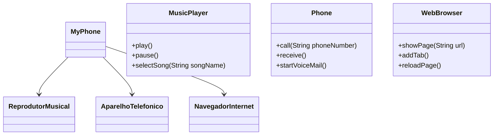

# My Phone (not iPhone)

## Class diagram

```mermaid
classDiagram

    class MyPhone {
    }

    MyPhone --> ReprodutorMusical
    MyPhone --> AparelhoTelefonico
    MyPhone --> NavegadorInternet
    
    class MusicPlayer {
        +play()
        +pause()
        +selectSong(String songName)
    }

    class Phone {
        +call(String phoneNumber)
        +receive()
        +startVoiceMail()
    }

    class WebBrowser {
        +showPage(String url)
        +addTab()
        +reloadPage()
    }
```